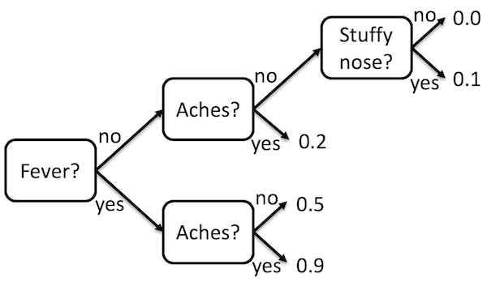

# Mitchell Tutorial: Gradient Boosted Decision Trees
{:.no_toc}

This tutorial will walk you through the process of implementing an algorithm for
gradient boosted decision trees in Mitchell. This implementation will make use
of the Mitchell Classification and Regression Trees (CART) and Decision Trees
(DT) libraries, as well as the
[LibSVM-compatible](https://xgboost.readthedocs.io/en/latest/tutorials/input_format.html)
file reader from the Mitchell IO libraries.

1. Generated Toc
{:toc}

## Background
### What are Decision Trees?

A [decision tree](https://en.wikipedia.org/wiki/Decision_tree_learning) is a
tool for classifying something based on a finite set of features. We will be
working with decision trees that map features to real values.

For example, the following decision tree can be used to determine the
probability that someone has the flu:



The tree is read from left to right. At each point in the tree a feature is
examined to determine which way to go. The results are stored at the leaves.

### The Mitchell DT Libraries

Mitchell includes two libraries for the representation decision tree libraries:
one for real-valued features and labels and one for integer-valued features and
labels. We will be using the tree for real-valued features and labels.

To use values, functions, and types from the decision tree library, you have
three choices. You can prefix the values, functions, and types with the
module name, like `DecisionTreeReal.forward`. If the name is too long, you can
give it a shorter name by writing

```sml
structure DT = DecisionTreeReal;
```

Then you will be able to write `DT.forward`. Or, if you don't want to prefix the
names at all, you can write

```sml
open DecisionTreeReal;
```

We recommend using one of the first two options, because names in different
modules can clash otherwise.

The decision tree itself is represented using the following datatype:

```sml
datatype dt = Lf of label | Nd of dt * feature * dt;
```

`dt` is the *type* for decision trees. A value of type `dt` can be one of two
things: a leaf of the tree or an internal node of the tree. `Lf` and `Nd` are
constructors used to create leaves and internal nodes, respectively.

A leaf node contains the label that the decision tree decides belongs to the
object. The internal node contains the feature value. If the feature value is
greater than the feature of the object, the left branch is taken. If the feature
value is less than the feature of the object, the right branch is taken.

The `label` type is declared just before `dt` in the library as a synonym for a
real number. Similarly, the `feature` type is declared as a synonym for a pair
of an integer (the feature identifier) and a real number (the feature value).

```sml
type label = real;
type feature = int * real;
```

To create a decision tree by hand, you would write

```sml
val myleaf1 = Lf 0.7;
val myleaf2 = Lf 0.0;
val mynode = Nd (myleaf1, (2, 1.0), myleaf2);
```

or on one line

```sml
val mynode = Nd ((Lf 0.7), (2, 1.0), (Lf 0.0));
```

Then `mynode` is the decision tree that you have defined. In order to look
inside of `mynode`, you use a `case` expression (which is different from a case
statement in language like C and Java):

```sml
(* This is Mitchell comment syntax. *)
val result =
  case mynode of
      Lf lab => ("A leaf label", lab) (* This is a pair of a string and a real. *)
    | Nd lhs (featureId, featureVal) rhs => ("A feature value", featureVal)
```

The `result` value will be `("A feature value", 1.0)`. We will see how to look
all of the way down a tree (rather than just at one node) a little bit later in
this tutorial.

The decision tree library also includes several functions for using decision
trees. We will explain those as we use them. You can also read about them in the
[documentation](../mitchell_lib_doc.md).

### The Mitchell CART Libraries

Mitchell has a library for creating decision trees from data using
[CART](https://en.wikipedia.org/wiki/Predictive_analytics#Classification_and_regression_trees_.28CART.29).

There are two CART implementations, one for working with integer-labeled
decision trees and one for working with real-labeled decision trees. We will be
using `CartReal`, which works with real-labeled decision trees. `CartReal` can
work with any real-labeled, real-featured decision tree implementation, so we
have to pick which one we will use before we can use `CartReal`. Modules that
can work with multiple implementations of other data structures like this are
called *functors*.

To specify that we want to use `CartReal` with `DecisionTreeReal`,
we do something similar to how we defined a shorter name for `DecisionTreeReal`.

```sml
structure C = CartReal(structure DT = DecisionTreeReal);
```

If you don't want to prefix things with `C.`, you can write

```sml
structure C = CartReal(structure DT = DecisionTreeReal);
open C;
```

to import everything.

Of particular interest in CartReal is the function `train`, which has type
`(DT.features * DT.label) list -> DT.t`. (Here `DT` is short for the kind of
decision tree we told `CartReal` to use.) To the left of the arrow are the types
of the inputs to the function. To the right of the arrow is type of the output.

In Mitchell some types, like `list`, work with other types. For example, a
list of integers would have type `int list`. In this case, the input to `train`
is a list of pairs, where the left-hand-side of the pair has feature
information, and the right-hand-size has labels.

Earlier we said the definitions for the `DT.feature` and `DT.label` types:

```sml
type label = real;
type feature = int * real;
```

This function uses the `DT.features` (not the same as `DT.feature`, note the "s"!) type, which is defined as an array of
integers (`array` is like `list`, in that it works with other types):

```sml
type features = int array;
```

The CART library requires that all of the training data use arrays of the same
size. That is, every feature array must have the same value for
[`Array.length`](http://sml-family.org/Basis/array.html#SIG:ARRAY.length:VAL).
The length of an array is specified by the first argument to
[`Array.array`](http://sml-family.org/Basis/array.html#SIG:ARRAY.array:VAL) when
creating an array containing all the same value, by the first argument to
[`Array.tabluate`](http://sml-family.org/Basis/array.html#SIG:ARRAY.tabulate:VAL)
when defining array using the value of a function applied to each of its
indices, or by the length of the list to be converted to an array using
[`Array.fromList`](http://sml-family.org/Basis/array.html#SIG:ARRAY.fromList:VAL).

### What is Gradient Boosting Decision Trees?

Gradient boosting is a way of combining lots of weak classifiers (such as
decision trees) to make a strong classifier. See
[here](https://www.ncbi.nlm.nih.gov/pmc/articles/PMC3885826/) for a a general
description of gradient boosting.

For decision trees, first, we train a decision tree on some data, and scale the
predictions of the decision tree by a parameter called the learning rate. That
decision tree will have a large amount of error. We compute the difference
between the predictions of the decision tree on the data and the actual labels
on the data. These differences are called the *residuals*.

To account for the error of the first decision tree, we train a new decision
tree on the residuals, and again scale by the learning rate. To compute the
predictions of the collection (or *ensemble*) of decision trees, we take the sum
of the predicted values. We repeat this process for some number of decision
trees.

This process continues until we meet some stopping criteria, such as the number
of decision trees we want in our ensemble.

### The Mitchell Gradient Boosted Decision Trees Library

Mitchell has a library for Gradient Boosted Decision Trees, as well as a library
for reading input to train and test the ensembles of decision trees. To use the
library, first import the modules:

```sml
structure C = CartReal(structure DT = DecisionTreeReal);
structure Gbdt = Gbdt(structure CART = C);
structure G_IO = LibSVMReader;
```

To read input in the format

```
0 2:1 5:1 6:1
1 2:1 6:1 12:1
0 3:1 5:1 12:1 13:1
```

where the first number is the label for an object, and the rest of the entries
are the feature number and value separated by a colon, use

```sml
val trainingData = G_IO.fromFile "/data/workload33-gbdt/agaricus.txt.train";
val testData = G_IO.fromFile "/data/workload33-gbdt/agaricus.txt.test";
```

To train the ensemble of trees and print the ensemble

```sml
val gbdt = Gbdt.train (trainingData, 0.8, 2);
val _ = print (Gbdt.toString gbdt);
```

If you use the input format example above as the training data, you will get the
rather uninteresting result of an ensemble of three single-node trees. Single
node trees just predict a single number, without looking at the features. They
arise in this case because of the limited amount of data used to train the
decision trees.

You can find more interesting data in `/data/workload33-gbdt/` or you can find
datasets online, such as
[here](https://www.csie.ntu.edu.tw/~cjlin/libsvmtools/datasets/binary.html#a1a).

To test the ensemble of trees and print the error

```sml
val error = Gbdt.error (gbdt, testData);
val _ = print ("error = " ^ (Real.toString error) ^ "\n");
```

## Building a Gradient Boosting Implementation

We will now walk through using the `CartReal` and `DecisionTreeReal` libraries
to build the GBDT algorithm from scratch.

You can find the training and test data for this workload in `/data/workload33-gbdt/`.

### Parsing

We are in the process of developing Mitchell libraries for ingesting data in
many common formats. As shown above, the input format used for gradient boosting
decision trees is one of the formats for which we have library support.

For other workloads we recommend using a language other than Mitchell for
preparing the data for use by Mitchell, and then implementing a simple data
ingesting function using the
[`TextIO`](http://sml-family.org/Basis/text-io.html) and
[`TextIO.StreamingIO`](http://sml-family.org/Basis/stream-io.html#STREAM_IO:SIG:SPEC)
modules to read the data into a string, and then parsing it with the functions
from [`Substring`](http://sml-family.org/Basis/substring.html) module, such as
`Substring.tokens`.

See the [tuorial on IO and parsing in Mitchell](tutorial-io-parsing.md) for more
information.

### Implementing the Algorithm

First, import the libraries that we will be using

```sml
structure DT = DecisionTreeReal;
structure C = CartReal(structure DT = DecisionTreeReal);
structure D = C.DT;
```

Gradient-boosting produces an ensemble of decision trees. We are going to
represent the ensemble as a list `D.t list`. `D.t` is the type of a single
decision tree.

#### Forward

First we will implement the forward-mode, prediction function for the ensemble
of decision trees. This involves applying the `D.forward` function to each
decision tree in the ensemble, and then summing the results. Mitchell includes
some helper functions and other features to make it easier for us to implement
this. Our `forward` function will have the type

```sml
(D.t list * D.features) -> real
```

That is, `forward` takes the ensemble and the features of the object to predict,
and produces a real number prediction.

To define `forward` we will use a `let` construct, which lets us define local
variables and helper functions that use the arguments to `forward`.

```sml
fun forward (ensemble, features) =
    let
      fun forwardTree tree = DT.forward (tree, features);
      val predictions = List.map forwardTree ensemble;
    in
      MathReal.sum predictions
    end;
```

First, we define `forwardTree`, which is a function that takes a tree and
applies `DT.forward` to it and the features. Then we use the library function
`List.map` to apply the `forwardTree` function to each of the trees in the
ensemble. The result of this is a list of predictions (`predictions: real
list`, read the colon `:` as "has type"). then we produce the final result by
summing the predictions.

`List.map` is a little different from other functions we have seen: rather than
taking its arguments in a *tuple* (like a pair), it takes its arguments
separately. Many of the functions from the subset of the Standard ML Basis
Library that is available in Mitchel will take arguments in this way. The
difference is mostly for convenience (taking the argument separately allows one
to *partially apply* the function), but we will not use any of those
conveniences in this tutorial and you do not need to use them in your code.

#### Loss Function

Next, we will implement the loss function. This takes an ensemble, features, and
the true label, and determines how far off the prediction is.

```sml
fun lossR (ensemble, features, actualLabel) =
    let
      val predictedLabel = forward (ensemble, features);
    in
      actualLabel / (1.0 + Math.exp(actualLabel * predictedLabel))
    end;
```


#### Scaling

One of the operations we have to perform on the decision trees is to scale the
predictions by a learning rate. This function will crawl the tree to find the
leaves, and then build the tree back up with scaled predictions at the leaves.

There are two interesting things about how we implement this function. First, we
implement the *recursively*, that is, in terms of itself. This works because
each internal node (`D.Nd`) has two smaller trees inside of it (`lhs` and
`rhs`). We can keep calling `scale` until we hit the smallest tree, a leaf
(`D.Lf`, which has no sub-trees), and everything bubbles back up.

The second interesting thing we do is use a helper function to implement
`scaleLeaves`. The helper function allows us to focus on the parts of the
program that change on each call (which sub-tree `scale` is being called on),
rather than on the parts that stay the same (the learning rate).

The scaling itself happens at the leaves, producing a new leaf with the
predicted label multiplied by the learning rate.

```sml
fun scaleLeaves (tree, learningRate) =
  let
    fun scale tree =
      case tree of
          D.Lf label => DT.Lf (label * learningRate)
        | D.Nd (lhs, feature, rhs) => D.Nd ((scale lhs), feature, (scale rhs));
  in
    scale tree
  end;
```

#### Training the Next Tree

When training a tree, one of the things we want to do to prevent over-fitting is
to prune the tree, and then select the tree that has the most leaves, but no
more leaves than the average number of nodes in all of the trees so far. To
select the best tree, we write a function that compares two trees based on the
number of leaves.

```sml
fun compareLeaves (avg, left, right) =
    if (D.leafNum left < avg) andalso (D.leafNum left > D.leafNum right)
    then Ord.GT
    else Ord.LT;
```

The return type `Ord.t` can be one of `Ord.GT`, `Ord.LT`, or `Ord.EQ`, which
stand for "greater than", "less than", and "equal to", respectively. Here we
return `Ord.GT` for the tree that we prefer.

We then use the comparison function to define a function that gets the "best"
tree from a list of trees.

```sml
fun findBest trees =
    let
      val avg = MathInt.average (List.map D.leafNum trees);
      fun comp (left, right) = compareLeaves (avg, left, right);
    in
      Ord.argmax comp trees
    end;
```

Like in earlier code snippets, we define a helper function that uses a value
that we computed.

The `findBest` function uses the `Ord.argmax` function to pick the best item
from the list, according to the comparison function that has been defined using
the average number of leaves in the trees. `Ord.argmax` returns a value of type
`DT.t option`, which can be one of two things. If the list given to
`Ord.argmax` is empty, then the result is `NONE`. Otherwise the list will be
`SOME t`, where `t` is the chosen tree.

Now we can define the function for computing the next tree to add to the ensemble.
This function builds on all of the techniques we've talked about so far to train
a new tree according to the algorithm.

```sml
fun calculateNextTree (ensemble, data, learningRate) =
    let
      fun lossForEnsemble (features, label) = lossR (ensemble, features, label);
      fun lossWithFeatures (features, label) = (features, lossForEnsemble (features, label))
      val residuals = List.map lossWithFeatures data;
      val trainedTree = C.train residuals;
      val prunedTreesWithEvaluationValue = C.prune (trainedTree, data);
      val prunedTrees = map #2 prunedTreesWithEvaluationValue
      val best = findBest prunedTrees;
      val bestTree = case best of NONE => trainedTree | SOME t => t;
    in
      scaleLeaves (bestTree, learningRate)
    end;
```

Finally, to train the whole ensemble, we need to take the number of trees we
want the ensemble to have and the learning rate that we will scale each tree by.
To implement this we use recursion again, but this time instead of calling the
function on a smaller tree each time, we will call it with a smaller depth each
time, until the depth hits zero.

To do this, we check the if the depth is zero. If it is (the `then` case), we
return a simple decision tree that just predicts the average label for
everything. If it is not zero (the `else` case), we ask for the ensemble trained
to a depth of one less than the current depth, and then train the tree for the
current depth on the residual for the ensemble.

This code snippet also shows how arbitrary expressions can go in the conditional
or branches of an `if` expression. `let ... in ... end` is an expression like
any other (whose value happens to be the value of the expression between `in`
and `end`), and so can be used as a branch of the `if` expression. We have to
nest the call to `train` within a branch of the `if` expression because
otherwise we'd have an infinite recursive call (i.e., an infinite loop).

```sml
fun train (data, learningRate, depth) =
    if depth = 0
    then [D.Lf (MathReal.average (List.map #2 data))]
    else
      let
        val ensemble = train (data, learningRate, depth - 1);
        val nextTree = calculateNextTree (ensemble, data, learningRate);
      in
        nextTree::ensemble
      end;
```

Here, the square brackets are how you write a list in Mitchell. The list in the
program contains a single element, which is a leaf node that returns the average
of the labels on the data.

The `#2` is the function that gets the second element of a tuple (e.g., the
right-hand side of a pair). Even though `#2` starts with a symbol, it is a normal function.
If you want to pass an operator (like `+`) as an argument, you need to prefix it with `op`,
as in `op+`.

The `::` at the end makes a new list out of the existing ensemble (which is
represented as a list) and the next tree to add to it. Since the ensemble is
used by summing the results of applying the individual trees, it doesn't matter
in what order the trees show up in the ensemble, so we put the new tree on the
front. If you wanted the trees in the other order, you could define another
function that called this one and reversed the list using `List.rev`.

For the advanced reader, you can try implementing the same function in
*accumulator style*.

```sml
fun train (data, learningRate, depth) =
    let
      val startEnsemble = [D.Lf (MathReal.average (List.map #2 data))]
      fun trainAcc (accEnsemble, depth) =
        if depth = 0
        then accEnsemble
        else
          let
            val nextTree = calculateNextTree (accEnsemble, data, learningRate)
          in
            trainAcc ((nextTree::accEnsemble), (depth - 1))
          end
    in
      trainAcc (startEnsemble, depth)
    end
```

You can now use your `train` function the same way that we used the library
`train` function. Defining an `error` function is left as an exercise for the
reader (you will probably want to use `MathReal.average` and `List.map` to implement it).

#### Printing the Tree

To print the tree, we first have to convert it to a string.

```sml
fun toString ensemble =
    let
      val stringTrees = List.map D.toString ensemble;
    in
      List.foldl (fn (tree, trees) => trees ^ ">>>>>\n" ^ tree) "" stringTrees
    end;
```

The `^` operator appends two strings.

Then we can use the normal `print` function to print the string.

## The Complete Program

The complete program is below.

```sml
structure DT = DecisionTreeReal;
structure C = CartReal(structure DT = DecisionTreeReal);
structure D = C.DT;

fun forward (ensemble, features) =
    let
      fun forwardTree tree = DT.forward (tree, features);
      val predictions = List.map forwardTree ensemble;
    in
      MathReal.sum predictions
    end;

fun lossR (ensemble, features, actualLabel) =
    let
      val predictedLabel = forward (ensemble, features);
    in
      actualLabel / (1.0 + Math.exp(actualLabel * predictedLabel))
    end;

fun scaleLeaves (tree, learningRate) =
  let
    fun scale tree =
      case tree of
          D.Lf label => DT.Lf (label * learningRate)
        | D.Nd (lhs, feature, rhs) => D.Nd ((scale lhs), feature, (scale rhs));
  in
    scale tree
  end;

fun compareLeaves (avg, left, right) =
    if (D.leafNum left < avg) andalso (D.leafNum left > D.leafNum right)
    then Ord.GT
    else Ord.LT;

fun findBest trees =
    let
      val avg = MathInt.average (List.map D.leafNum trees);
      fun comp (left, right) = compareLeaves (avg, left, right);
    in
      Ord.argmax comp trees
    end;

fun calculateNextTree (ensemble, data, learningRate) =
    let
      fun lossForEnsemble (features, label) = lossR (ensemble, features, label);
      fun lossWithFeatures (features, label) = (features, lossForEnsemble (features, label))
      val residuals = List.map lossWithFeatures data;
      val trainedTree = C.train residuals;
      val prunedTreesWithEvaluationValue = C.prune (trainedTree, data);
      val prunedTrees = map #2 prunedTreesWithEvaluationValue
      val best = findBest prunedTrees;
      val bestTree = case best of NONE => trainedTree | SOME t => t;
    in
      scaleLeaves (bestTree, learningRate)
    end;

fun train (data, learningRate, depth) =
    if depth = 0
    then [D.Lf (MathReal.average (List.map #2 data))]
    else
      let
        val ensemble = train (data, learningRate, depth - 1);
        val nextTree = calculateNextTree (ensemble, data, learningRate);
      in
        nextTree::ensemble
      end;

fun toString ensemble =
    let
      val stringTrees = List.map D.toString ensemble;
    in
      List.foldl (fn (tree, trees) => trees ^ ">>>>>\n" ^ tree) "" stringTrees
    end;

fun error (ensemble, testData) =
    let
      fun isPredictionCorrect (features, label) =
          (forward (ensemble, features) < 0.0) = (label < 0.0)
      fun tallyErrors (features, label) =
          if isPredictionCorrect (features, label)
          then 0
          else 1
      val errors = List.map tallyErrors testData
      val errorCount = MathInt.sum errors
    in
        (Real.fromInt errorCount) / (Real.fromInt (List.length testData))
    end

val trainingData = LibSVMReader.fromFile "/data/workload33-gbdt/agaricus.txt.train"
val ensemble = train (trainingData, 0.5, 2)
val _ = print ((toString ensemble) ^ "\n")
val testData = LibSVMReader.fromFile "/data/workload33-gbdt/agaricus.txt.test"
val predictionError = error (ensemble, testData)
val _ = print ("Prediction error: " ^ (Real.toString predictionError) ^ "\n")
```
